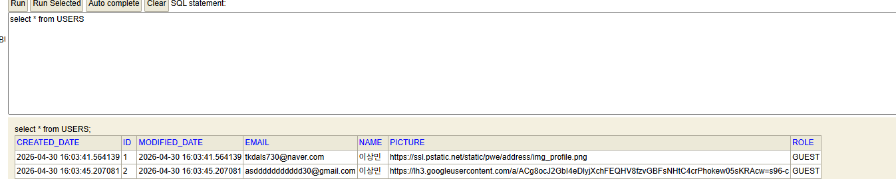

# 진행 상황

- # Day 1 — IntelliJ + Spring Boot 환경 + Hello + 테스트 코드

- Spring Boot 3.2.0 / Java 17 / Gradle 프로젝트 생성
- HelloController (/hello) + HelloControllerTest (@WebMvcTest + MockMvc)
- Lombok 도입 → HelloResponseDto (@Getter, @RequiredArgsConstructor) + /hello/dto + 단위 테스트

---

# Day 2 — JPA + REST API CRUD

- H2 + Spring Data JPA 의존성 추가
- Posts 엔티티 (@Entity, @Builder, update() 도메인 메서드, Setter 금지)
- PostsRepository + 저장/조회 테스트
- 요청/응답 DTO 분리 (PostsSaveRequestDto, PostsUpdateRequestDto, PostsResponseDto)
- PostsService (save / update — 더티 체킹 / findById)
- PostsApiController (POST / PUT / GET) + 통합 테스트
- H2 콘솔 활성화 (/h2-console)
- BaseTimeEntity + @EnableJpaAuditing 으로 생성/수정 시간 자동 기록
- (정리) 선행 작성된 delete() 코드를 Day 3 (교재 4-5) 강의로 이관  

_____
# 네이버 로그인 동작
